# 📅 Frituur Ordering System - Implementation Plan

> My 6-week roadmap to build an awesome frituur ordering system

## 🎯 What I'm Building

**Project**: Frituur Ordering System - A Multilingual Modular Monolith  
**Student**: Nikolaos Sporidis  
**Duration**: 6 weeks (Nov 24 - Jan 17) + Exam week  
**Approach**: Solo development with comprehensive documentation and testing

### 🎨 Visual Timeline

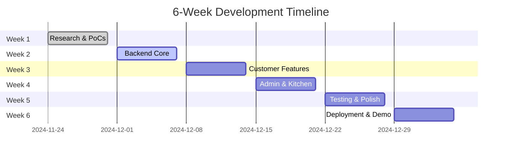

---

## 🎯 My Goals

- 🏗️ **Build a complete system** - End-to-end ordering for frituur restaurants
- 🎓 **Learn advanced concepts** - Show Software Engineering principles
- 📚 **Create great documentation** - Professional and comprehensive
- 💻 **Showcase modern skills** - Full-stack development with latest tech

---

## 🎯 Feature Prioritization (What to Build First)

I'm organizing features into three phases to make sure I build the most important things first.

### 🚀 Phase 1: Must-Have (Core Functionality)
**The essentials - without these, the system doesn't work**

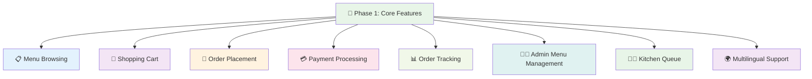

| ✅ Feature | 🎯 Why It's Essential | 📱 Who Uses It |
|------------|----------------------|----------------|
| **📋 Menu Browsing** | Customers need to see what's available | 👤 Customers |
| **🛒 Shopping Cart** | Core ordering functionality | 👤 Customers |
| **📝 Order Placement** | Turn cart into actual order | 👤 Customers |
| **💳 Payment Processing** | How customers pay | 👤 Customers |
| **📊 Order Tracking** | See order status | 👤 Customers |
| **👨‍💼 Admin Menu Management** | Staff need to manage menu | 👨‍💼 Admins |
| **👨‍🍳 Kitchen Queue** | Kitchen staff need to see orders | 👨‍🍳 Kitchen |
| **🌍 Multilingual Support** | Dutch/English for Belgium | 👥 Everyone |

### ⭐ Phase 2: Important (Enhanced Experience)
**Makes the system much better, but not essential for basic functionality**

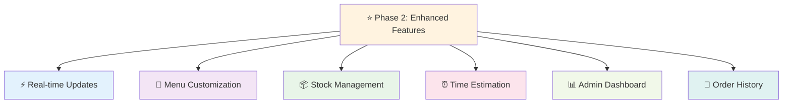

### 🌟 Phase 3: Nice-to-Have (Polish & Advanced)
**Cool features that make the system shine, but can be added later**

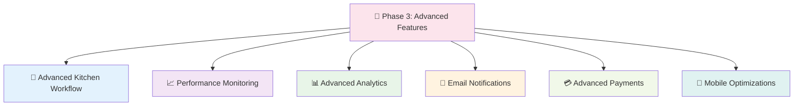

**Fallback Strategy**: If I run out of time, I can drop Phase 3 features and still have a complete, working system!

---

## 📅 6-Week Timeline (My Development Journey)

### 🎯 Week 1: Research & PoCs (Nov 24-29) - 30 hours
**Focus**: Research validation and foundation setup

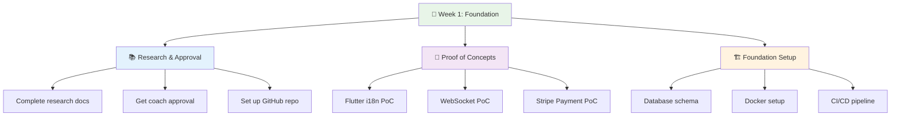

#### 📚 Day 1-2: Research & Approval (12 hours)
- [ ] 📝 Complete research documentation
- [ ] 👨‍🏫 Get coach approval for research and approach
- [ ] 🐙 Set up GitHub repository with proper structure

#### 🧪 Day 3-4: PoC Implementation (12 hours)
- [ ] 🌍 **Flutter i18n** (Dutch/English switching) - 3 hours
- [ ] ⚡ **NestJS + WebSocket** basic setup - 4 hours
- [ ] 💳 **Stripe Payment** integration - 4 hours
- [ ] 📄 Document PoC results and decisions - 1 hour

#### 🏗️ Day 5: Foundation Setup (6 hours)
- [ ] 🗄️ Create initial domain model and database schema - 3 hours
- [ ] 🐳 Set up development environment with Docker - 2 hours
- [ ] 🔄 Configure CI/CD pipeline basics - 1 hour

**🎯 Week 1 Deliverables**:
- ✅ Research approval from coach
- ✅ Working PoCs demonstrating core technologies
- ✅ Repository structure with initial setup

### 🖥️ Week 2: Backend Core (Dec 1-6) - 30 hours
**Focus**: Backend foundation and core APIs

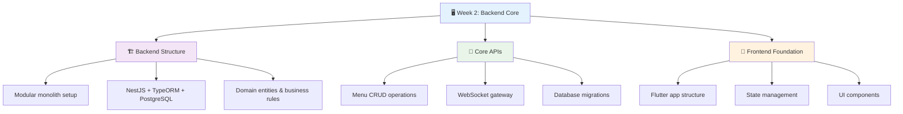

#### 🏗️ Day 1-2: Backend Structure (12 hours)
- [ ] 🏠 **Modular monolith structure** (6 modules) - 4 hours
- [ ] ⚙️ **NestJS + TypeORM + PostgreSQL** setup - 3 hours
- [ ] 📊 **Domain entities and value objects** - 3 hours
- [ ] 🧠 **Basic business rules and domain services** - 2 hours

#### 🔌 Day 3-4: Core APIs (12 hours)
- [ ] 📋 **Menu CRUD operations** - 4 hours
- [ ] ⚡ **WebSocket gateway** for real-time updates - 3 hours
- [ ] 🗄️ **Database migrations and seeding** - 3 hours
- [ ] 🔐 **Basic authentication and authorization** - 2 hours

#### 📱 Day 5: Frontend Foundation (6 hours)
- [ ] 📱 **Flutter customer app structure** - 2 hours
- [ ] 🔄 **State management with Provider** - 2 hours
- [ ] 🧭 **Basic navigation and routing** - 1 hour
- [ ] 🎨 **Initial UI components and themes** - 1 hour

**🎯 Week 2 Deliverables**:
- ✅ Working backend API with modular structure
- ✅ Database schema with sample data
- ✅ Basic menu management endpoints
- ✅ Flutter app foundation

### 👤 Week 3: Customer Experience (Dec 8-13) - 30 hours
**Focus**: Customer-facing features

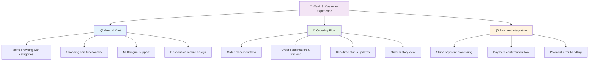

#### 📋 Day 1-2: Menu & Cart (12 hours)
- [ ] 🍟 **Menu browsing with categories** - 4 hours
- [ ] 🛒 **Shopping cart functionality** - 4 hours
- [ ] 🌍 **Multilingual support** (Dutch/English) - 2 hours
- [ ] 📱 **Responsive design for mobile** - 2 hours

#### 📝 Day 3-4: Ordering Flow (12 hours)
- [ ] 📝 **Order placement flow** - 4 hours
- [ ] ✅ **Order confirmation and tracking** - 3 hours
- [ ] ⚡ **Real-time order status updates** - 3 hours
- [ ] 📄 **Order history view** - 2 hours

#### 💳 Day 5: Payment Integration (6 hours)
- [ ] 💳 **Stripe payment processing** - 4 hours
- [ ] ✅ **Payment confirmation flow** - 1 hour
- [ ] ⚠️ **Payment error handling** - 1 hour

**🎯 Week 3 Deliverables**:
- ✅ Complete customer ordering experience
- ✅ Working payment integration
- ✅ Real-time order tracking
- ✅ Multilingual support

### 👨‍💼 Week 4: Admin & Kitchen (Dec 15-20) - 30 hours
**Focus**: Admin interface and kitchen workflow

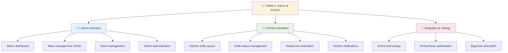

#### 👨‍💼 Day 1-2: Admin Interface (12 hours)
- [ ] 📊 **Create admin dashboard** - 4 hours
- [ ] 📝 **Implement menu management** (CRUD) - 4 hours
- [ ] 📦 **Add stock management functionality** - 2 hours
- [ ] 🔐 **Create admin authentication** - 2 hours

#### 👨‍🍳 Day 3-4: Kitchen Workflow (12 hours)
- [ ] 📋 **Implement kitchen order queue** - 4 hours
- [ ] ✅ **Create order status management** - 3 hours
- [ ] ⏰ **Add ready time estimation algorithm** - 3 hours
- [ ] 🔔 **Implement kitchen notifications** - 2 hours

#### 🔗 Day 5: Integration & Testing (6 hours)
- [ ] 🧪 **End-to-end testing of complete flow** - 3 hours
- [ ] ⚡ **Performance optimization** - 2 hours
- [ ] 🐛 **Bug fixes and polish** - 1 hour

**🎯 Week 4 Deliverables**:
- ✅ Complete admin interface
- ✅ Working kitchen workflow
- ✅ End-to-end system functionality
- ✅ Performance optimizations

### 🧪 Week 5: Testing & Polish (Dec 22-27) - 30 hours
**Focus**: Testing, documentation, and polish

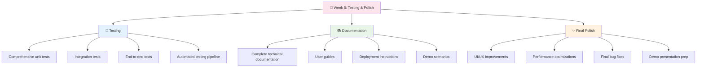

#### 🧪 Day 1-2: Testing (12 hours)
- [ ] 🔧 **Write comprehensive unit tests** - 4 hours
- [ ] 🔗 **Implement integration tests** - 4 hours
- [ ] 🎭 **Create end-to-end tests** - 2 hours
- [ ] 🤖 **Set up automated testing pipeline** - 2 hours

#### 📚 Day 3-4: Documentation (12 hours)
- [ ] 📖 **Complete technical documentation** - 4 hours
- [ ] 👥 **Create user guides** - 3 hours
- [ ] 🚀 **Write deployment instructions** - 2 hours
- [ ] 🎬 **Create demo scenarios** - 3 hours

#### ✨ Day 5: Final Polish (6 hours)
- [ ] 🎨 **UI/UX improvements** - 2 hours
- [ ] ⚡ **Performance optimizations** - 2 hours
- [ ] 🐛 **Final bug fixes** - 1 hour
- [ ] 🎤 **Prepare demo presentation** - 1 hour

**🎯 Week 5 Deliverables**:
- ✅ Comprehensive test suite
- ✅ Complete documentation
- ✅ Polished user experience
- ✅ Demo-ready system

### 🚀 Week 6: Deployment & Demo (Dec 29 - Jan 3) - 30 hours
**Focus**: Deployment and presentation preparation

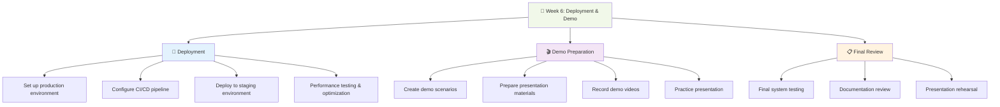

#### 🚀 Day 1-2: Deployment (12 hours)
- [ ] 🌐 **Set up production environment** - 4 hours
- [ ] 🔄 **Configure CI/CD pipeline** - 3 hours
- [ ] 🧪 **Deploy to staging environment** - 2 hours
- [ ] ⚡ **Performance testing and optimization** - 3 hours

#### 🎬 Day 3-4: Demo Preparation (12 hours)
- [ ] 🎭 **Create demo scenarios** - 4 hours
- [ ] 📊 **Prepare presentation materials** - 3 hours
- [ ] 🎥 **Record demo videos** - 2 hours
- [ ] 🎤 **Practice presentation** - 3 hours

#### 📋 Day 5: Final Review (6 hours)
- [ ] 🧪 **Final system testing** - 2 hours
- [ ] 📚 **Documentation review** - 2 hours
- [ ] 🎤 **Presentation rehearsal** - 2 hours

**🎯 Week 6 Deliverables**:
- ✅ Deployed production system
- ✅ Demo presentation
- ✅ Complete documentation
- ✅ Final project submission

---

## Risk Management

### High-Risk Items
1. **Stripe Integration**: Early PoC implementation, fallback to mock payments
2. **WebSocket Stability**: Connection pooling, fallback to polling
3. **Time Estimation Algorithm**: Simple algorithm, easy to adjust

### Medium-Risk Items
1. **Real-time Updates**: WebSocket + PostgreSQL LISTEN/NOTIFY
2. **Multilingual Support**: Flutter i18n, well-documented feature
3. **Database Performance**: Proper indexing, query optimization

### Mitigation Strategies
- **Early PoCs**: Validate technical assumptions before full implementation
- **Feature Prioritization**: Must-have vs nice-to-have clearly defined
- **20% Timeline Buffer**: Built into each week for unexpected issues
- **Fallback Plans**: Alternative approaches for high-risk components

---

## Success Metrics

### Functional Requirements
- [ ] Customer can complete full order flow in <5 minutes
- [ ] Kitchen staff can update order status in <30 seconds
- [ ] System handles 100+ concurrent users without degradation
- [ ] All UI elements available in Dutch and English
- [ ] Payment processing works reliably with Stripe
- [ ] Real-time updates work consistently across all clients

### Technical Requirements
- [ ] <2s page load times
- [ ] <500ms API response times
- [ ] >80% test coverage
- [ ] Clean architecture with proper separation of concerns
- [ ] Comprehensive documentation
- [ ] One-command deployment

### Academic Requirements
- [ ] Complete research flow with evidence
- [ ] Proper architecture documentation
- [ ] Working prototype with demo scenarios
- [ ] Professional presentation
- [ ] Reflection on outcomes and trade-offs

---

## Daily Planning

### Daily Routine (6 hours/day)
- **Morning (3 hours)**: Core development work
- **Afternoon (2 hours)**: Testing and documentation
- **Evening (1 hour)**: Planning and progress review

### Weekly Reviews
- **Monday**: Plan week objectives and priorities
- **Wednesday**: Mid-week progress check and adjustments
- **Friday**: Week completion review and next week planning

### Progress Tracking
- **GitHub Issues**: Track all tasks and bugs
- **Daily Standup**: Personal progress review
- **Weekly Demos**: Show progress to maintain momentum
- **Milestone Reviews**: Assess against success criteria

---

## Tools & Environment

### Development Tools
- **IDE**: VS Code with Flutter and TypeScript extensions
- **Version Control**: Git with GitHub
- **Database**: PostgreSQL with pgAdmin
- **API Testing**: Postman or Insomnia
- **Containerization**: Docker and Docker Compose

### Project Management
- **Task Tracking**: GitHub Issues and Projects
- **Documentation**: Markdown files in repository
- **Communication**: Regular coach check-ins
- **Time Tracking**: Simple time logging

### Quality Assurance
- **Code Quality**: ESLint, Prettier, Flutter analyze
- **Testing**: Jest (backend), Flutter test (frontend)
- **CI/CD**: GitHub Actions
- **Code Review**: Self-review with checklist

---

## Next Steps

### Immediate Actions (Today)
1. **Review and approve this implementation plan**
2. **Set up GitHub repository with proper structure**
3. **Begin Week 1 tasks: Research completion and PoC planning**

### Week 1 Priorities
1. **Complete research documentation**
2. **Get coach approval**
3. **Implement critical PoCs**
4. **Set up development environment**

### Success Indicators
- [ ] Coach approval obtained
- [ ] All PoCs working with evidence
- [ ] Development environment functional
- [ ] Ready to begin Week 2 implementation

---

## 🎯 Success Metrics (How I Know I'm Done)

### 📊 Functional Requirements
- [ ] 👤 Customer can complete full order flow in <5 minutes
- [ ] 👨‍🍳 Kitchen staff can update order status in <30 seconds
- [ ] 🚀 System handles 100+ concurrent users without degradation
- [ ] 🌍 All UI elements available in Dutch and English
- [ ] 💳 Payment processing works reliably with Stripe
- [ ] ⚡ Real-time updates work consistently across all clients

### 🛠️ Technical Requirements
- [ ] ⚡ <2s page load times
- [ ] 🔌 <500ms API response times
- [ ] 🧪 >80% test coverage
- [ ] 🏗️ Clean architecture with proper separation of concerns
- [ ] 📚 Comprehensive documentation
- [ ] 🚀 One-command deployment

### 🎓 Academic Requirements
- [ ] 📊 Complete research flow with evidence
- [ ] 🏗️ Proper architecture documentation
- [ ] 🎭 Working prototype with demo scenarios
- [ ] 🎤 Professional presentation
- [ ] 🤔 Reflection on outcomes and trade-offs

---

## 🎨 Visual Progress Tracker

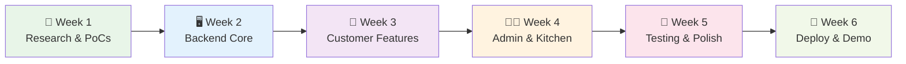

## 🎯 What I'll Have at the End

By the end of 6 weeks, I'll have built:

- 🍟 **Complete frituur ordering system** - Customers can order, pay, and track
- 👨‍💼 **Admin interface** - Staff can manage menu and orders
- 👨‍🍳 **Kitchen workflow** - Clear order queue and status management
- 🌍 **Multilingual support** - Dutch and English throughout
- ⚡ **Real-time updates** - Live order status and notifications
- 💳 **Secure payments** - Stripe integration for safe transactions
- 📱 **Cross-platform app** - Works on web and mobile
- 🧪 **Well-tested system** - Comprehensive test coverage
- 📚 **Professional documentation** - Ready for academic evaluation

**Remember**: Focus on core functionality first, then add enhancements. The goal is a working, demonstrable system that meets all academic requirements.

**Ready to build something awesome! 🚀**
