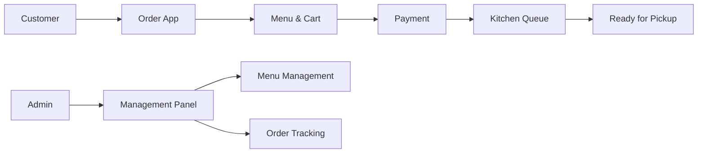
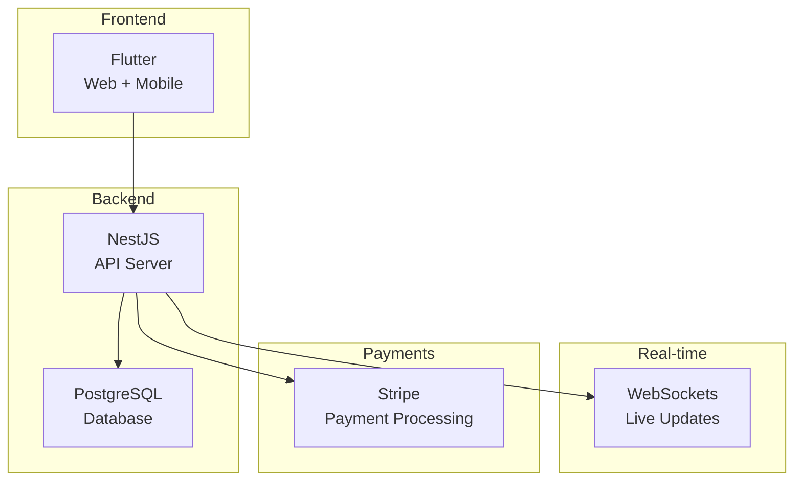
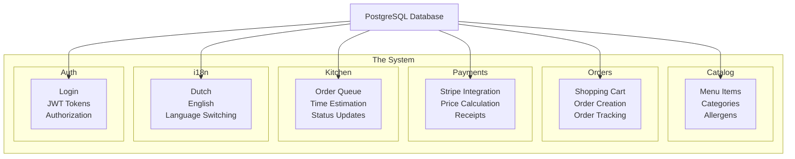

# 🍟 Frituur Ordering System

> A modern ordering system for frituur restaurants with real-time updates and multilingual support

## 🎯 What Am I Building?

I'm creating a complete ordering system that lets customers order food online and helps kitchen staff manage orders efficiently. Think of it like Uber Eats, but specifically designed for frituur restaurants.

### Visual Overview



### Key Features

| Feature | What It Does | Why It's Cool |
|---------|--------------|---------------|
| **Customer App** | Browse menu, add to cart, pay, track order | Works on phone and computer |
| **Admin Panel** | Manage menu, see orders, update status | Kitchen staff can work efficiently |
| **Real-time Updates** | See order status change instantly | No more "where's my food?" |
| **Multilingual** | Dutch and English support | Perfect for Belgium! |
| **Secure Payments** | Stripe integration | Safe and reliable |
| **Kitchen Workflow** | Clear order queue and status updates | Staff know exactly what to make |

## 🛠️ Tech Stack (The Tools I'm Using)



**Why These Tools?**

- **Flutter**: One codebase for web and mobile (saves time!)
- **NestJS**: Great TypeScript support, built-in features
- **PostgreSQL**: Reliable database with JSON support for multilingual content
- **WebSockets**: Real-time updates without page refreshes
- **Stripe**: Industry-standard payment processing

## 📚 Documentation (What's in This Folder)

I've streamlined the documentation to focus on what matters most:

| Document | What It's For | When to Use |
|----------|---------------|-------------|
| **[RESEARCH.md](RESEARCH.md)** | Complete research process with all academic requirements | Coach approval, school evaluation |
| **[TECHNICAL_DESIGN.md](TECHNICAL_DESIGN.md)** | System architecture and technical details | When coding and implementing |
| **[IMPLEMENTATION_PLAN.md](IMPLEMENTATION_PLAN.md)** | 6-week timeline with daily breakdown | Daily planning and progress tracking |

### 📋 Research Deliverables Completed

✅ **Research Objective** - Clear problem definition and success metrics  
✅ **Stakeholders & Context** - User personas and use case scenarios  
✅ **Core Concepts** - 8 key concepts with academic sources  
✅ **Comparative Analysis** - Technology evaluation with evidence  
✅ **Requirements** - Functional and non-functional requirements  
✅ **Architecture Options** - Tech stack justification and design  
✅ **Proofs of Concept** - 4 PoCs with implementation plans  
✅ **Publication Strategy** - Repository structure and CI/CD  
✅ **Plan & Milestones** - 6-week timeline with deliverables  
✅ **Alternatives Considered** - Rejected options with rationale

### 🎨 Documentation Features

- **Visual Elements**: Mermaid diagrams and tables for better understanding
- **Academic Rigor**: Proper citations and evidence-based decisions
- **Professional Quality**: Suitable for academic evaluation and industry review

## 🚀 Quick Start (How to Run This)

### What You Need First

- **Node.js 18+** (for the backend)
- **Flutter 3.16+** (for the frontend)
- **PostgreSQL 14+** (for the database)
- **Docker** (optional, but makes life easier)

### Step-by-Step Setup

```bash
# 1. Get the code
git clone <repository-url>
cd frituur-ordering-system

# 2. Start the backend
cd backend
npm install
npm run start:dev

# 3. Start the frontend (in a new terminal)
cd frontend
flutter pub get
flutter run -d web

# 4. Set up the database
createdb frituur_ordering
npm run migration:run
npm run seed
```

### Configuration

Copy the example environment file and add your settings:

```bash
cp env.example .env
# Then edit .env with your database and Stripe info
```

## 🏗️ How It's Built (Architecture)

The core of this system is designed as a **Modular Monolith**. This means the application is made up of well-separated modules—like clearly defined rooms in one house—so each part has its own responsibility but everything runs as a single, unified application.



**Why This Architecture?**

- **Easy to understand**: Each "room" has one job
- **Easy to test**: Test each room separately
- **Easy to maintain**: Change one room without breaking others
- **Perfect for solo development**: Not too complex, not too simple

## 🧪 Testing (Making Sure It Works)

### Backend Tests

```bash
cd backend
npm run test              # Test individual functions
npm run test:e2e          # Test complete workflows
npm run test:cov          # See how much is tested
```

### Frontend Tests

```bash
cd frontend
flutter test              # Test UI components
flutter test integration_test/  # Test user interactions
```

## 🚀 Deployment (Making It Live)

### Easy Docker Setup

```bash
# Start everything at once
docker-compose up -d

# See what's happening
docker-compose logs -f

# Stop everything
docker-compose down
```

## 📊 Performance Goals

| Metric | Target | Why It Matters |
|--------|--------|----------------|
| **Page Load** | <2 seconds | Users won't wait longer |
| **API Response** | <500ms | Feels instant |
| **Real-time Updates** | <100ms | Live updates feel smooth |
| **Concurrent Users** | 100+ | Can handle busy times |

## 🎓 About This Project

**Course**: Software Engineering Project  
**Student**: Nikolaos Sporidis  
**Duration**: 6 weeks (Nov 24 - Jan 17)  
**Tech Stack**: Flutter + NestJS + PostgreSQL + WebSockets + Stripe  
**Architecture**: Modular Monolith (organized but not overcomplicated)

## License

This project is open source under the MIT License - see the [LICENSE](LICENSE) file for details.
