# 🏗️ Frituur Ordering System - Technical Design

> How I'm building this system step by step

## 🎯 What This Document Is

This is my technical blueprint - it shows exactly how I'm building the frituur ordering system. Think of it as the architectural plans for a house, but for software.

**Tech Stack**: Flutter + NestJS + PostgreSQL + WebSockets + Stripe  
**Architecture**: Modular Monolith (organized but not overcomplicated)  
**Timeline**: 6 weeks (solo development)

---

## 🏠 System Architecture

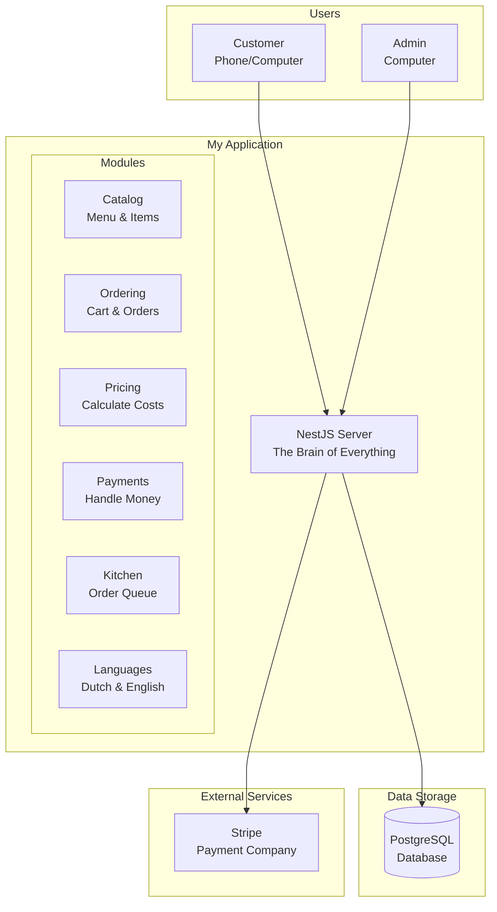

**What's Happening Here?**

- **Users** interact with the app (customers order, admins manage)
- **My Application** processes everything (the NestJS server)
- **Modules** are doing there own jobs (catalog, ordering, pricing, etc.)
- **Database** stores all the information
- **Stripe** handles payments securely

## 🏠 Core Modules

The system is organized into several core modules, each responsible for a specific part of the application's functionality. Think of each module as a dedicated room in a house, focused on its own job.

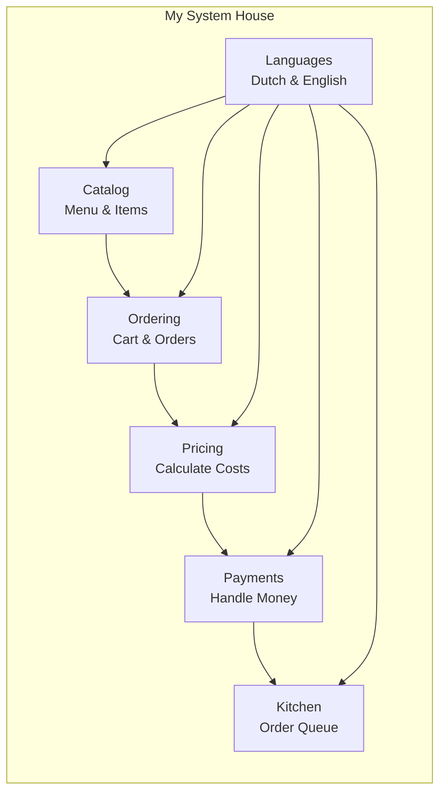

### Catalog Module

**What it does**: Manages all the food items

- Menu items (fries, burgers, drinks)
- Categories (appetizers, mains, desserts)
- Allergen information (gluten, nuts, etc.)
- Stock availability (what's available today)

### Ordering Module

**What it does**: Handles the ordering process

- Shopping cart (add/remove items)
- Order creation (turn cart into order)
- Order tracking (where is my food?)

### Pricing Module

**What it does**: Figures out costs and timing

- Price calculations (base price + extras)
- Ready time estimation (when will it be ready?)
- Discount logic (special offers)

### Payments Module

**What it does**: Handles all payment stuff

- Stripe integration (secure payments)
- Payment processing (charge the card)
- Transaction history (payment records)

### Kitchen Module

**What it does**: Helps kitchen staff work efficiently

- Order queue (what needs to be made)
- Status updates (in progress, ready, etc.)
- Workflow optimization (make it efficient)

### i18n Module

**What it does**: Makes everything multilingual

- Dutch language support
- English language support
- Language switching (change language anytime)

---

## 🗄️ Database Design

Think of the database like a well-organized filing cabinet where I store all the information about the frituur system.

### Database Structure

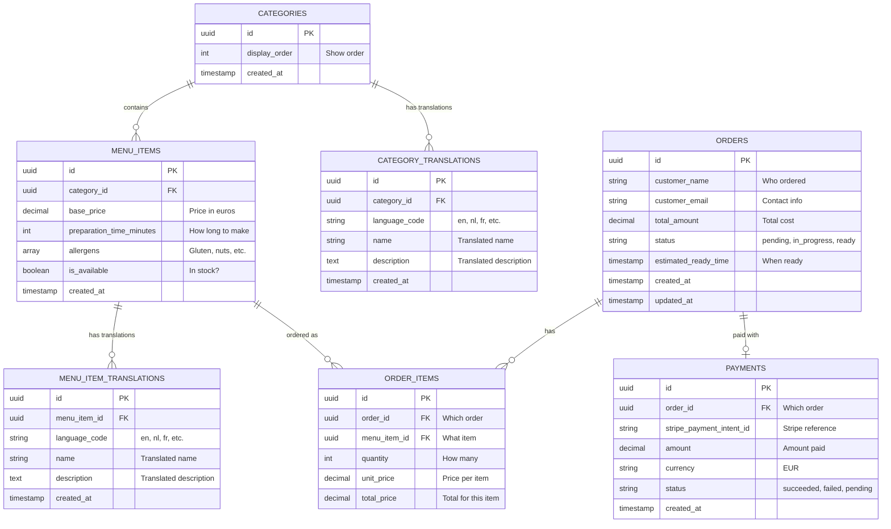

### What Each Table Stores

| Table | Purpose | Example Data |
|-------|---------|--------------|
| **Categories** | Food categories (language-agnostic) | Category structure and ordering |
| **Category Translations** | Category names in different languages | "Appetizers" (EN), "Voorgerechten" (NL) |
| **Menu Items** | Individual food items (language-agnostic) | Price, prep time, allergens, availability |
| **Menu Item Translations** | Item names/descriptions in different languages | "Large Fries" (EN), "Grote Frietjes" (NL) |
| **Orders** | Customer orders | "Order #123 for John Doe" |
| **Order Items** | Items in each order | "2x Large Fries, 1x Cheeseburger" |
| **Payments** | Payment information | "Payment for Order #123 - €15.50" |

### Multilingual Support (Normalized Approach)

Instead of separate columns for each language, I use separate translation tables:

- **Categories** → **Category Translations** (one row per language)
- **Menu Items** → **Menu Item Translations** (one row per language)

**Benefits:**

- ✅ **Easy to add languages** - Just insert new translation rows
- ✅ **No schema changes** - Adding French, German, etc. requires no database changes
- ✅ **Better performance** - Only load translations you need
- ✅ **Cleaner queries** - Join when you need translations

**Example Query:**

```sql
-- Get menu items in Dutch
SELECT m.*, t.name, t.description 
FROM menu_items m
JOIN menu_item_translations t ON m.id = t.menu_item_id
WHERE t.language_code = 'nl';
```

### How Tables Connect

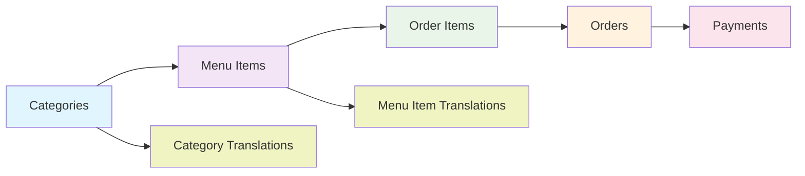

**The Flow**:

1. **Categories** contain **Menu Items** (Appetizers → Fries)
2. **Menu Items** become **Order Items** when added to cart
3. **Order Items** belong to **Orders** (customer's order)
4. **Orders** have **Payments** (how they paid)
5. **Categories** and **Menu Items** have **Translations** (multilingual support)

---

## 🔌 API Design

This section explains how the API connects the frontend and backend. It covers both the main REST endpoints and the real-time WebSocket events.

### REST Endpoints (Regular Requests)

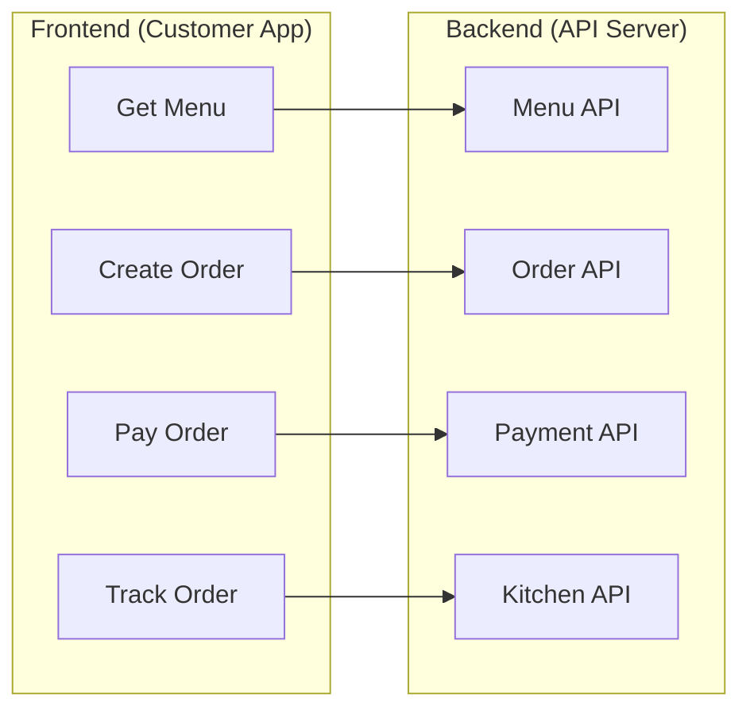

| What I Need | API Endpoint | What It Does |
|-------------|--------------|--------------|
| **Get Menu** | `GET /api/menu/categories` | Show all food categories |
| **Get Items** | `GET /api/menu/items?category=appetizers` | Show items in a category |
| **Create Order** | `POST /api/orders` | Create a new order |
| **Track Order** | `GET /api/orders/123` | Check order status |
| **Pay Order** | `POST /api/payments/create-intent` | Start payment process |
| **Kitchen View** | `GET /api/kitchen/orders` | Show orders to kitchen staff |

### WebSocket Events (Real-time Updates)

WebSockets for real-time communication!

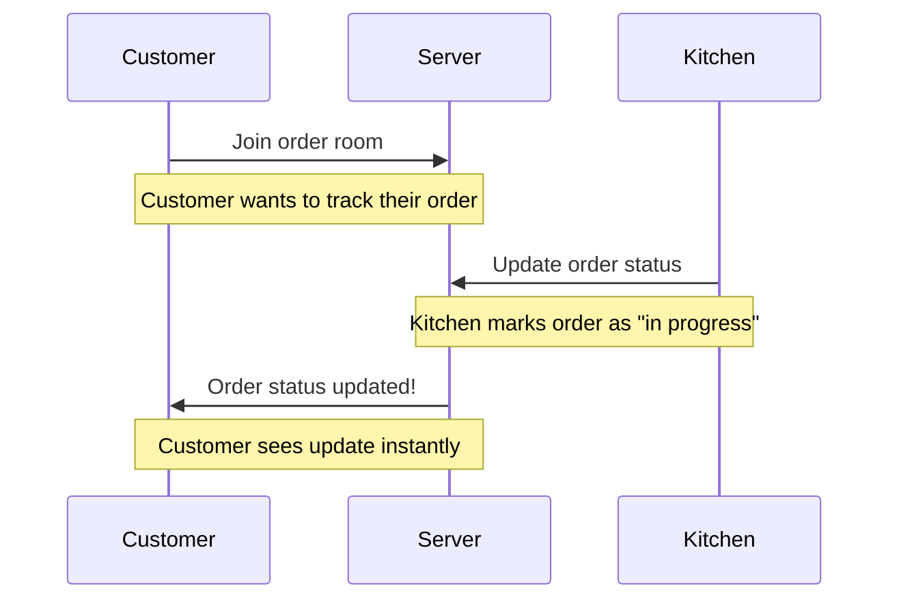

**What Happens in Real-time:**

- **Order Status Changes**: "pending" → "in progress" → "ready"
- **Stock Updates**: When items run out or come back
- **Time Updates**: When estimated ready time changes
- **Notifications**: Important updates for customers

### The Complete Flow

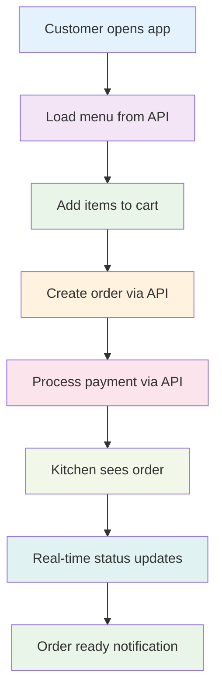

---

## 📱 Flutter App Structure (Frontend)

The Flutter app is structured to keep things modular, clean, and scalable. Each folder has a clear purpose to make developing and maintaining features faster and easier.

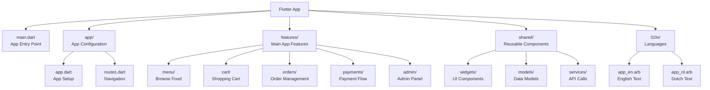

### What Each Folder Does

| Folder | Purpose | Example |
|--------|---------|---------|
| **app/** | App setup and navigation | How the app starts and moves between screens |
| **features/** | Main app functionality | Menu browsing, cart, orders, payments |
| **shared/** | Reusable components | Buttons, forms, API services |
| **l10n/** | Language files | "Betaal" vs "Pay" (Dutch/English) |

---

## 🖥️ NestJS Backend Structure (Backend)

The backend uses the NestJS framework for a modular, maintainable codebase. Each business domain is separated into its own module, making development and scaling easier.

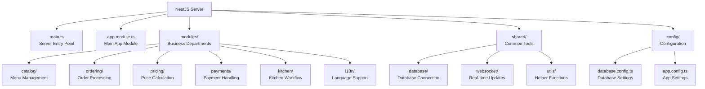

### What Each Module Does

| Module | Department Job | Who Uses It |
|--------|----------------|-------------|
| **catalog** | Manages menu items and categories | Customers browsing, admins editing |
| **ordering** | Handles shopping cart and orders | Customers placing orders |
| **pricing** | Calculates costs and timing | System automatically |
| **payments** | Processes payments with Stripe | Customers paying |
| **kitchen** | Manages order queue and status | Kitchen staff |
| **i18n** | Handles Dutch/English switching | All users |

---

## 🔒 Security

Security is a top priority in any software project to ensure that user data and business information remain safe. This system includes multiple layers of safeguards to protect against threats and unauthorized access.

### What I'm Protecting Against

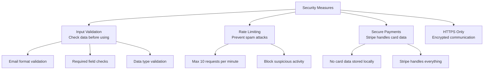

### Testing

Testing is essential to ensure the reliability and quality of the frituur ordering system.

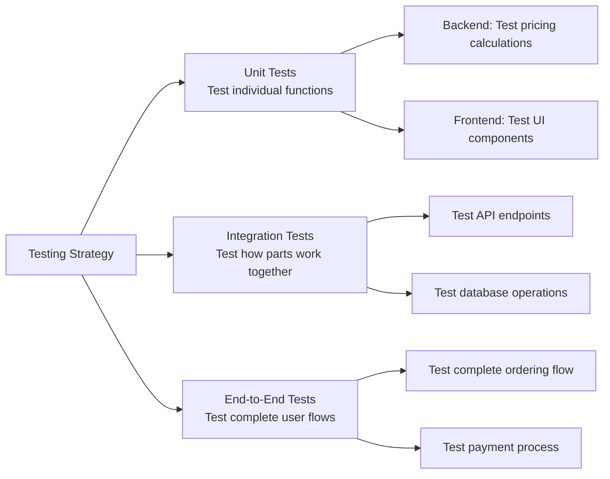

**Testing Goals:**

- **80%+ code coverage** - Most of the code is tested
- **All critical paths tested** - Important features work
- **Automated testing** - Tests run automatically

---

## 🚀 Deployment

Deploying the frituur ordering system brings the project from development into real-world use. This step ensures all components are connected, secure, and running smoothly on their production environment.

### Docker Setup (Easy Deployment)

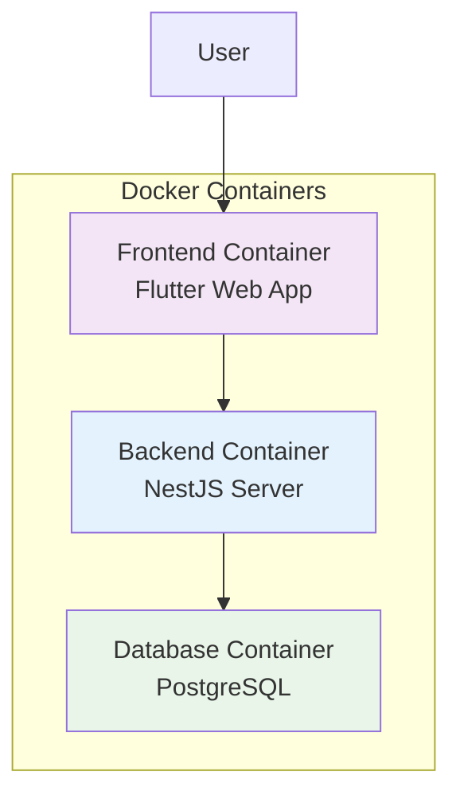

**Why Docker?**

- **Consistent environment** - Works the same everywhere
- **Easy deployment** - One command to start everything
- **Easy development** - Same setup for everyone

### Performance Goals

| Goal | Target | Why It Matters |
|------|--------|----------------|
| **Page Load** | <2 seconds | Users won't wait longer |
| **API Response** | <500ms | Feels instant |
| **Real-time Updates** | <100ms | Live updates feel smooth |
| **Concurrent Users** | 100+ | Can handle busy times |

---

## 🔮 Future Enhancements (What I Could Add Later)

### Phase 2 (After MVP)

- **Performance boost** - Redis caching, faster responses
- **Email notifications** - "Your order is ready!"
- **Analytics dashboard** - See what's popular

### Phase 3 (Advanced Features)

- **Multi-restaurant support** - Multiple frituur locations
- **Advanced reporting** - Detailed business insights
- **Inventory management** - Track ingredients
- **Delivery tracking** - GPS tracking for delivery
- **Loyalty program** - Rewards for regular customers

---

## 🎯 Summary

This technical design shows how I'm building a professional, scalable frituur ordering system using modern technologies. The modular architecture makes it easy to understand, test, and maintain, while the comprehensive feature set provides real value to both customers and restaurant staff.

**Key Strengths:**

- 🏗️ **Clean architecture** - Easy to understand and modify
- 🌍 **Multilingual support** - Perfect for Belgium
- ⚡ **Real-time updates** - Modern user experience
- 🔒 **Secure payments** - Industry-standard security
- 📱 **Cross-platform** - Works on web and mobile
- 🧪 **Well-tested** - Reliable and maintainable

**Ready to build something awesome! 🚀**